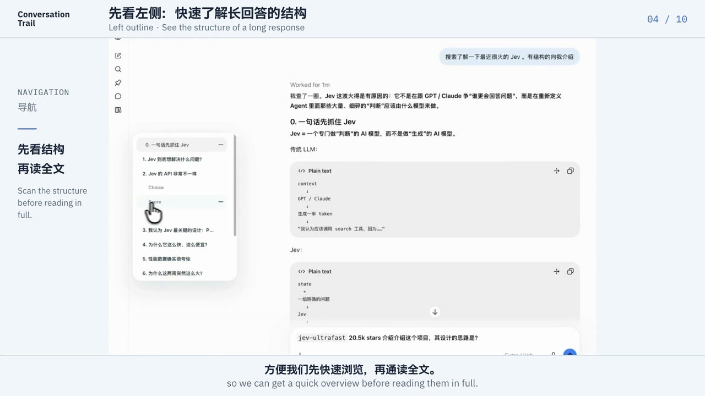

# Conversation Trail

[中文](README.md) | English

I tend to keep a single ChatGPT conversation going for a long time. ChatGPT’s built-in conversation trail on the web can be unreliable, and scrolling through a long thread just to find an earlier question gets old fast. That’s why I built this extension.

It adds two simple ways to navigate a long conversation: answers on the left, questions on the right.

- **Response outline**: Lists the headings in the answer you are currently reading. Click a heading to jump to it; the outline also updates while the answer is still being generated.
- **Question trail**: Lists the questions you have asked in the current conversation. Click one to return to that turn.
- **Audio mode (optional)**: A 1:1 recreation of ChatGPT desktop’s waveform mode. Put on some music and the two rails move with the left and right channels, adding a sense of immersion and presence while you read. Navigation works normally without audio mode or the local audio component.

The rails stay tucked against the edges of the page until you hover over them. A small dot marks your current reading position. Dark mode, keyboard navigation, and the system’s reduced-motion setting are supported.

[Watch the English demo](demo/conversation-trail-en.mp4) · About 1 min 32 sec · English narration, Chinese–English subtitles

## Installation

You need **Chrome 116+**. Audio mode also requires **macOS 13+**; the current download is for **Apple Silicon Macs**.

1. Download the ZIP from [Releases](https://github.com/Johnny-xuan/conversation-trail/releases) and extract it.
2. To use audio mode, double-click **Conversation Trail Audio.pkg** and complete the installation. Skip this step if you only want the navigation features.
3. Open `chrome://extensions` and turn on **Developer mode** in the top-right corner.
4. Click **Load unpacked** and select the **Conversation Trail Extension** folder from the download.
5. Open or refresh [ChatGPT](https://chatgpt.com/).

Chrome reads the extension directly from this folder, so do not move or delete it after installation.

Installers with a `-preview` suffix have not yet been notarized by Apple, so macOS may block the installation. Check the corresponding release notes for the current status.

## Usage

- **Return to an earlier question**: Hover over the right rail to open the question list, then click a question to return to that turn.
- **Navigate the current answer**: The left rail lists the headings in the answer you are reading. Click a heading to jump to it. Answers without headings do not show an outline.
- **Keep track of your position**: As you scroll, the dots follow the current question and heading.

To turn on audio mode, click the extension icon in Chrome and enable **系统音频声浪**. Local Audio Engine starts automatically. The first time you use it, grant the system-audio permission when macOS asks. Then play music or any other system audio, and the rails will move with it.

Your audio-mode setting is saved for all ChatGPT tabs in the current Chrome profile. You do not need to turn it on again after refreshing the page or restarting Chrome. If authorization or the connection needs attention, use **继续授权** or **重新连接** in the extension popup.

## Privacy

The extension does not save your conversations. The only setting it stores is whether audio mode is enabled.

When audio mode is on, Local Audio Engine converts system audio into spectrum data in memory. It does not save recordings, perform speech recognition or transcription, or upload audio or spectrum data.

macOS places this permission under **Screen & System Audio Recording**, but Local Audio Engine receives audio only and does not capture the screen. The audio service accepts local connections only and stops capturing when no clients are using it.

## Thanks

This project was forked from [grid-oaa/ChatGPT-helper](https://github.com/grid-oaa/ChatGPT-helper) and continues to build on that foundation.

## Contributing

Found a bug or have an idea? Open an [issue](https://github.com/Johnny-xuan/conversation-trail/issues) or send a PR. For larger changes, start with an issue and describe the use case so we can agree on the direction first.
